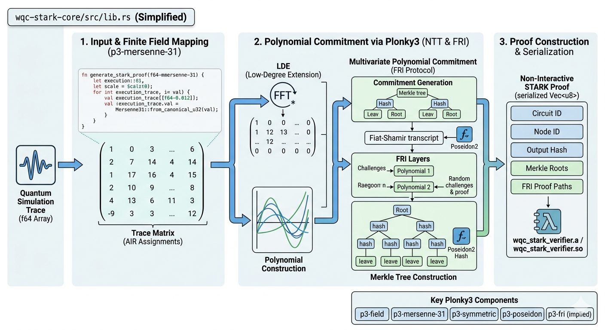

# wqc-stark-engine

A high-performance STARK (Scalable Transparent ARgument of Knowledge) cryptographic engine designed for the decentralized mesh network. This repository serves as the core cryptographic backend for the Go-based orchestrator (`wqc-orchestrator`).

## Architecture Overview

This repository is structured as a Cargo Workspace to maintain a clean separation between the pure cryptographic logic and the C-compatible Foreign Function Interface (FFI).

```text
wqc-stark-engine/
├── Cargo.toml          # Workspace manifest
├── wqc-stark-core/     # Pure Rust implementation of STARK prover/verifier (crate-type = ["lib"])
└── wqc-stark-ffi/      # C-compatible wrapper for Go/CGO integration (crate-type = ["staticlib", "cdylib"])
```

* **`wqc-stark-core`**: Contains the core STARK proving and verifying logic (targeting production-grade frameworks such as Lambdaworks or Polygon Plonky3).
* **`wqc-stark-ffi`**: Provides a panic-safe, C-compatible API layer that compiles into static and dynamic libraries for seamless CGO binding.

## Architecture Map


## Usage

### Using Cargo (Local Development)
```bash
cargo build --release

```

### Using Docker
You can build and run this utility without needing a local Rust environment.

#### 1. Build the image:
```bash
docker build -t wqc-stark-builder .
```

#### 2. Copy out the compiled libraries:
```bash
# Run a temporary container to copy out the compiled artifacts
docker run --rm -v "$(pwd)/dist:/output" wqc-stark-builder \
    cp target/release/libwqc_stark_verifier.a \
       target/release/libwqc_stark_verifier.so \
       /output/
```

## License
Distributed under the GNU General Public License v3.0 (GPLv3). See `LICENSE` for more information.
